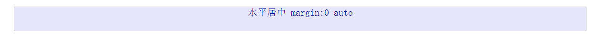

# 居中

#####**水平居中**


```
<div class="box c mg horizontal-center">水平居中  margin:0 auto</div>
```
```
.c{
    width: 90%;
  }
.horizontal-center{
    margin: 0 auto;
 }
```


#####**完全居中(水平、垂直)**

```
.s{
    width: 50%;
    height: 100px;

    background: aquamarine;
  }
.absolute-center{
    margin: auto;
    position: absolute;
    top: 0;
    left: 0;
    bottom: 0;
    right: 0;
  }
```
```
<div class="sbox c mg horizontal-center ">
    <div class="s absolute-center">完全居中</div>
</div>
```

######**优缺点**


######**解析**
1. 在普通内容流中，`margin:auto`时，对应的`margin-top,margin-bottom`的值等于`0`
2. `position:absolute;`块元素脱离文档流
3. 设置`top:0;left:0;bottom:0;right:0;`,重新设置块元素的盒子边界。此时，块元素会完全填充上级父元素的空间，该父元素可以是`body`或`position:relative`的容器。
4. 设置块元素的宽度`width`或高度`height`,避免元素占据所有的可用空间，并迫使浏览器在新的盒子边界上计算`margin:auto`（此时对于`margin-top`和`margin-bottom`,值不再为`0`）
5. 当块元素绝对定位并脱离文档流后，浏览器对`margin-top`和`margin-bottom`分配相等的值，从而达到垂直居中的效果。


#####**负margin**

```
.is-negative{
    width: 300px;
    height: 50px;
    padding: 20px;
    position: absolute;
    top: 50%;
    left: 50%;
    margin-left: -170px; /* (width + padding)/2 */
    margin-top: -45px; /* (height + padding)/2 */
  }
```
```
<!--负margin-->
<div class="sbox c mg horizontal-center">
    <div class="s is-negative">负margin</div>
</div>
```
######**优缺点**
优点:
- 跨浏览器，包括IE6-7
- 代码量少

注意项：
- 没有响应式，不能设置百分值及`min-/max-`
- 内容会溢出容器
- 需要理解`padding`或`box-sizing:border-box`的使用


######**解析**


#####**transform**


```
.is-transform {
	width: 50%;
	margin: auto;
	position: absolute;
	top: 50%;
	left: 50%;
	-webkit-transform: translate(-50%, -50%);
	-ms-transform: translate(-50%, -50%);
	transform: translate(-50%, -50%);
}
```
```
<!--transform-->
<div class="sbox c mg horizontal-center">
    <div class="bg is-transform">transform</div>
</div>
```
######**优缺点**
优点:
- 内容高度可变
- 代码量少

注意项：
- 不支持IE8
- 需要代理商前缀签`-webkit-等`
- 会干扰其他`transform`的效果


######**解析**


#####**table-cell**


```
.is-table {
	display: table;
}

.is-table .table-cell {
	display: table-cell;
	vertical-align: middle;
}

.is-table .center-block {
	width: 50%;
	margin: 0 auto;
}
```

```
<!--table-cell-->
<div class="sbox c mg horizontal-center is-table">
    <div class="table-cell">
        <div class="bg center-block">Table Cell</div>
    </div>
</div>
```

######**优缺点**
优点:
- 内容高度可变
- 内容溢出时自动拉伸父级元素
- 跨浏览器

注意项：
- 需要额外的标签
- 
######**解析**


#####**inline-block**

```
.is-inline {
	text-align: center;
	overflow: auto;
}

.is-inline:after, .is-inline .center-block {
	display: inline-block;
	vertical-align: middle;
}

.is-inline:after {
	content: "";
	height: 100%;
	margin-left: -.25em; /* To offset spacing. May vary by font */
}

.is-inline .center-block {
	max-width: 99%;
	/* Prevents issues with long content causes the content block to be pushed to the top */
	/* max-width: calc(100% - 0.25em) /* Only for IE9+ */
}
```
```
<!--inline-block -->
<div class="sbox c mg horizontal-center is-inline">
    <div class="bg center-block">Inline Block</div>
</div>
```
######**优缺点**
优点:
- 内容高度可变
- 内容溢出时自动拉伸父级元素
- 跨浏览器，支持IE7

注意项：
- 需要一个容器
- 水平居中的正确性依赖于`margin-left:-0.25em;`，可能需要根据不中字体大小`font-size`做出调整。
- 内容块的宽度不能超过父级容器的宽度-0.25em(calc(100%-.25em))


######**解析**

#####**flex box**

```
.is-flexbox {
	display: -webkit-box;
	display: -moz-box;
	display: -ms-flexbox;
	display: -webkit-flex;
	display: flex;
	
	-webkit-box-align: center;
	-moz-box-align: center;
	-ms-flex-align: center;
	-webkit-align-items: center;
	align-items: center;
	
	-webkit-box-pack: center;
	-moz-box-pack: center;
	-ms-flex-pack: center;
	-webkit-justify-content: center;
	justify-content: center;
}
```

```
<!--flex box -->
<div class="sbox c mg horizontal-center is-flexbox">
    <div class="bg">FlexBox</div>
</div>
```
######**优缺点**
优点:
- 内容可以是任意宽高
- 可用于较高级的布局技术

注意项：
- 不支持IE8-9
- 需要一个容器或者在`body`上设置样式
- 需要供应商前缀来适配现代浏览器

#####**阅读**
- [Absolute Centering](http://codepen.io/shshaw/full/gEiDt)
- [centering-in-the-unknown](https://css-tricks.com/centering-in-the-unknown/)
- [centering-percentage-widthheight-elements](https://css-tricks.com/centering-percentage-widthheight-elements/)

#####**代码**
```
<!DOCTYPE html>
<html>
<head lang="en">
    <meta charset="UTF-8">
    <title></title>
    <style>
        .mg{
            margin-top:20px !important;
            margin-bottom: 20px !important;
        }
        .box,.sbox{
            height: 200px;

            text-align: center;
            font-size: 20px;
            color: darkblue;
            border: 1px silver solid;
            background: lavender;

        }
        .box{
            height: 50px;
        }
        .sbox{
            position: relative;
            font-size: 14px;
        }
        .bg{
            background: aquamarine;
        }

        .c{
            width: 90%;
        }
        .s{
            width: 50%;
            height: 100px;

            background: aquamarine;
        }

        .horizontal-center{
            margin: 0 auto;
        }
        .absolute-center{
            margin: auto;
            position: absolute;
            top: 0;
            left: 0;
            bottom: 0;
            right: 0;
        }

        .is-negative{
            width: 300px;
            height: 50px;
            padding: 20px;
            position: absolute;
            top: 50%;
            left: 50%;
            margin-left: -170px; /* (width + padding)/2 */
            margin-top: -45px; /* (height + padding)/2 */
        }

        .is-transform{
            width: 50%;
            margin: auto;
            position: absolute;
            top: 50%;
            left: 50%;
            -webkit-transform: translate(-50%,-50%);
            -ms-transform: translate(-50%,-50%);
            transform: translate(-50%,-50%);
        }

        .is-table{
            display: table;
        }
        .is-table .table-cell{
            display: table-cell;
            vertical-align: middle;
        }
        .is-table .center-block{
            width: 50%;
            margin: 0 auto;
        }


        .is-inline{
            text-align: center;
            overflow: auto;
        }
        .is-inline:after,
        .is-inline .center-block{
            display: inline-block;
            vertical-align: middle;
        }
        .is-inline:after{
            content: "";
            height: 100%;
            margin-left: -.25em;/* To offset spacing. May vary by font */
        }
        .is-inline .center-block{
            max-width: 99%; /* Prevents issues with long content causes the content block to be pushed to the top */
            /* max-width: calc(100% - 0.25em) /* Only for IE9+ */
        }


        .is-flexbox{
            display: -webkit-box;
            display: -moz-box;
            display: -ms-flexbox;
            display: -webkit-flex;
            display: flex;
            -webkit-box-align: center;
            -moz-box-align: center;
            -ms-flex-align: center;
            -webkit-align-items: center;
            align-items: center;
            -webkit-box-pack: center;
            -moz-box-pack: center;
            -ms-flex-pack: center;
            -webkit-justify-content: center;
            justify-content: center;
        }

    </style>
</head>
<body>
<div class="box c mg horizontal-center">水平居中  margin:0 auto</div>

<div class="sbox c mg horizontal-center ">
    <div class="s absolute-center">完全居中</div>
</div>

<!--负margin-->
<div class="sbox c mg horizontal-center">
    <div class="s is-negative">负margin</div>
</div>

<!--transform-->
<div class="sbox c mg horizontal-center">
    <div class="bg is-transform">transform</div>
</div>

<!--table-cell-->
<div class="sbox c mg horizontal-center is-table">
    <div class="table-cell">
        <div class="bg center-block">Table Cell</div>
    </div>
</div>

<!--inline-block -->
<div class="sbox c mg horizontal-center is-inline">
    <div class="bg center-block">Inline Block</div>
</div>

<!--flex box -->
<div class="sbox c mg horizontal-center is-flexbox">
    <div class="bg">FlexBox</div>
</div>

</body>
</html>
```