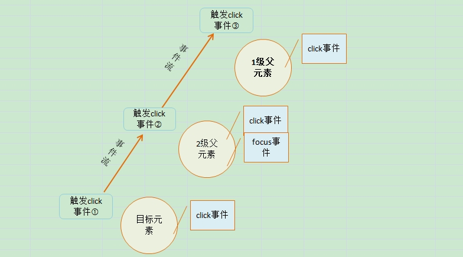

# 事件流_事件模型

#####**什么是事件流？**

事件流描述的是从页面中接收事件的顺序。

#####**事件流的分类:**
######**事件冒泡流和事件捕获流**

- `IE`的事件流叫做事件冒泡，即事件开始时由最具体的元素（目标元素）接收，然后逐级向上传播到最外层父级元素（`document`）。

- 网景的事件流叫做事件捕获。事件捕获的思想是最外层父级元素（`document`）接收到事件，目标元素最后接收到事件。

`DOM`事件流，`DOM2`级事件规定的事件流包括三个阶段：事件捕获阶段、处于目标阶段和事件冒泡阶段。

事件冒泡解析：


上图的事件发生顺序为①→②→③，当触发点击事件①时，沿着事件流传播，只有绑定了`click`事件的元素能够触发，即是说2级父级元素的`focus`事件得不到触发,而2级父级元素的`click`事件，在目标元素发生`click`事件后，也会跟着被触发。  
**`NOTE:`** 这就存在了取消冒泡机制的情况，因为你不想触发目标元素事件的同时，触发父级元素的事件。

#####**什么是事件模型？**

事件模型是指对事件的处理方式。目前存在三种事件模型。

######**原始事件模型**

在原始事件模型中，事件发生后没有传播的概念，没有事件流。事件发生到结束，不会对其他周边元素产生影响。

######**那么那些事件属于原始事件模型？**

```
1、<input type=”button” onclick=”fun()”/>

2、document.getElementById(“uid”).onclick = fun
```
######**原始事件模型的优缺点**

优点：兼容所有浏览器。

缺点：
1. 逻辑与显示没有分离
2. 一个事件句柄只能绑定一个处理程序(函数)——定义多个处理函数，则最后一个处理函数将覆盖前面的处理函数；
3. 没有事件冒泡和委托机制。

<br>
#####**IE事件模型**

绑定监听函数的方式：`attachEvent(“eventType”,”handler”)`，其中`eventType`表示事件类型，如`onclick`，须在事件类型前加“`on`”。

解除事件监听的方式：`detachEvent(“eventType”,”handler”)`;

优点: 
1. 实现逻辑和显示分离；
2. 能够绑定多个监听函数；
3. 有事件冒泡和委托机制。

缺点：IE事件模型只适用于IE浏览器，不兼容其他浏览器。


<br>
#####**DOM2事件模型**

`DOM2`事件模型是`W3C`制定的标准模型。一个事件的发生包含三个阶段：事件捕获阶段、目标事件阶段、事件冒泡阶段。

所有事件类型都会经历捕获阶段，但只有部分事件会经历冒泡阶段，如`submit`提交事件就没有冒泡阶段。

标准模型绑定监听函数的方法：`addEventListener(“eventType”,”handler”,true|false)`，其中`eventType`表示事件类型，如`click`，注意事件类型前面不用加“`on`”，`true|false`表示绑定的事件监听器在哪个阶段触发。`true`表示捕获阶段触发，`false`表示在冒泡阶段触发。

如果要阻止事件冒泡，标准规范中的方法为`event.preventDefault()`；`IE`中的方法为`event.cancelBubble=true`;
