# 原型_原型链

**原型是`Javascript`实现继承的基础**

在`Javascript`中，一切都是对象，当然除了一些值类型的基本类型，如 `boolean、number、undefined、string`。

每个函数都有一个`prototype`属性，这个属性指向一个对象，即原型对象。原型对象可以拥有属性和方法，这些属性和方法为这个函数所构造的实例所共有。

默认的，每个原型对象都有一个`constructor`属性，指向相应的构造函数。通过该构造函数`new`出来的实例对象，就共享了对应原型对象的属性和方法。如果原型对象的`constructor`属性没有指向对应的构造函数，那么，通过`new`关键字创建出来实例对象将无法继承该原型对象的属性和方法。为什么？每个实例对象都有隐含一个`__proto__`属性，这个属性指向创建该实例对象的函数的`prototype`属性所指向的原型对象，即是说`new Foo().__proto__==Foo.prototype`。实例对象根据`__proto__`属性链实现继承。即，实例对象会共享`__proto__`属性所指向的原型对象的属性和方法。


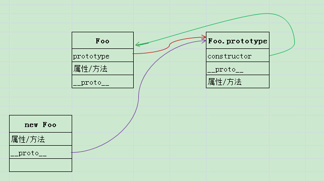


**如果原型对象的constructor属性指向另外一个函数，会有什么影响？
**

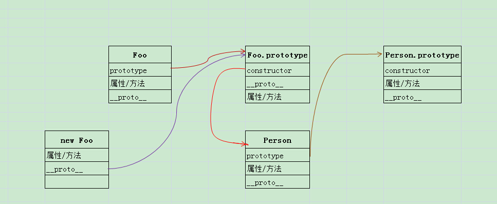


####**`NOTE` 下面部分有误**
```
function Foo(){
 var name = "SCER",
 age = 12,
 walk = function(){ 
 console.log("I am waking.");
 };
}

/*Person构造函数*/
function Person(){}

/*Foo的原型对象的属性和方法*/
Foo.prototype.country = "CN";
Foo.prototype.say = function(){ console.log("Hello, I am testing.")};

/*修改原型对象默认的constructor属性指向*/
Foo.prototype.constructor = Person;

/*创建Foo实例对象*/
var foo = new Foo();

```
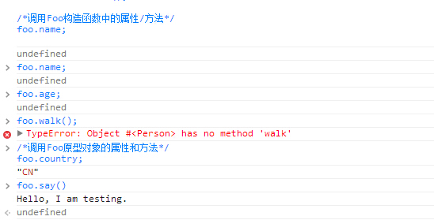

~~可见，Foo.prototype原型对象的constructor属性没有指向对应的函数时，通过Foo构造函数创建出来的实例对象（foo）并没有构造出Foo函数的副本——即这个实例对象并没有对构造函数的属性和方法进行复制，而是仅仅创建了一个”空”的对象。然而，这个对象却始终包含着从原型对象中继承的属性和方法。~~

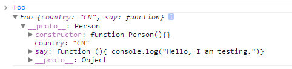

~~但是当恢复原型对象的constructor属性指向时，发现结果还是错误的。~~

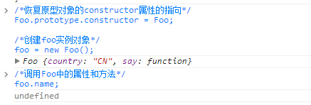

~~从结果中可以看出，恢复constructor属性指向后，实例对象仍然没有实现对Foo构造属性和方法的复制。为什么？~~


---


####**构造函数和普通函数的区别**

构造函数的声明格式：

```
function Animate(){
   this.name = "Li",
   this.yield = function(){ console.log("wowow~")};
}
```

普通函数的声明格式：

```
function animate(){
   var name = "Li";
   console.log(name + "is yielding");
}
```

很明显，构造函数一般为包含属性和方法的函数(将来表示某一对象具有某一性质或能力)，而普通函数则是为了实现某一特定功能而编写的方法。同时，构造函数和普通函数还有一大区别是，构造函数中并没有使用var关键字声明变量，而直接使用this关键字。

<br>
#####**为什么要使用`this`关键字？**
`this`关键字是执行上下文的一部分，执行上下文在函数调用时创建。对于构造函数，则在使用`new`关键字创建实例时产生执行上下文环境。

在构造函数中，使用`new`关键字创建实例时，`this`表示的是该实例对象。也就是说，`this.属性`（`this.name`）或`this.方法（this.walk=function(){}）`表示该实例对象的属性和方法；最后用一个变量`foo`指向该内存空间以获取使用权。

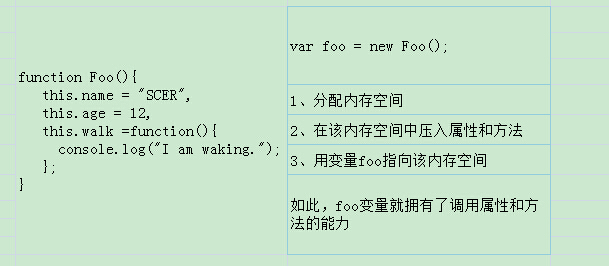


**如果构造当做普通函数使用会怎样？**

```
function Dog(){
 this.name = "Li",
 this.age = 23;
 console.log(this);
}

```

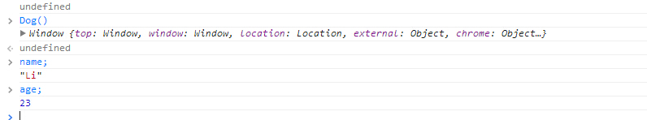

此时，`this`指向`window`窗口，属性都是全局变量。


**回到上面的问题：如果原型对象的constructor属性指向另外一个函数，会有什么影响？
**

答案是：对象实例的`constructor`指向错误，需要手动设置维持指向的一致性。

**下面探讨一下**

```
function Foo(){
 this.name = "SCER",
 this.age = 12,
 this.walk = function(){ 
   console.log("I am waking."); 
 };
}

/*Person构造函数*/
function Person(){}

/*Foo的原型对象的属性和方法*/
Foo.prototype.country = "CN";
Foo.prototype.say = function(){ console.log("Hello, I am testing.")};

/*修改原型对象默认的constructor属性指向*/
Foo.prototype.constructor = Person;

/*创建Foo实例对象*/
var foo = new Foo();

```

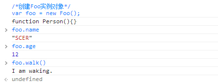

由上面对构造函数和`this`的分析可知，原型对象的`constructor`属性的指向似乎对实例对象的构建和继承不存在影响。上面示例也证明了这点，那么原型对象的`constructor`属性有什么作用呢？


不管是原型对象还是构造函数或对象，都有一个`constructor`属性，指向一个构造函数。

######**原型对象：**
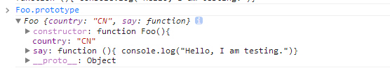

######**`Foo.prototype.constructor`**
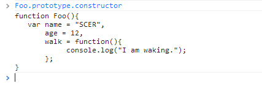

######**`Foo.constructor`**
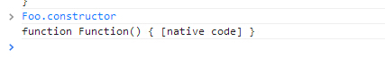

######**`foo.constructor`**
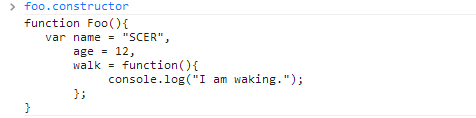

你会发现原型对象的`constructor`属性和实例对象的`constructor`属性指向同一个构造函数

```
> foo.constructor===Foo.prototype.constructor
> true
```

而构造函数的`constructor`属性指向`Function`函数。默认下，任何实例对象的`constructor`属性都指向它的构造函数。任何函数都是`Function`函数的实例对象，因此函数的`constructor`属性指向`Function`函数。`Function`函数的`constructor`属性指向`Function`构造函数自身。

知道这个特性后，除了通过`instanceof` 来判断一个对象是否是一个函数的实例外，还可以这样判断。

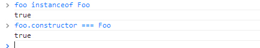

**改变原型对象的`constructor`属性后，有何变化？**
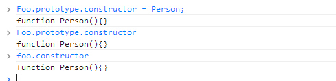

>此时,`foo`的`constructor`属性指向发生了变化。但需要注意的是，`foo`仍然是`Foo`构造函数的实例对象（一个对象是否是某个构造函数的实例对象，关键在于这个实例对象由哪个函数构建——谁构建便是谁的实例对象）；只是该实例对象的`constructor`属性再也不指向创建它的构造函数了。

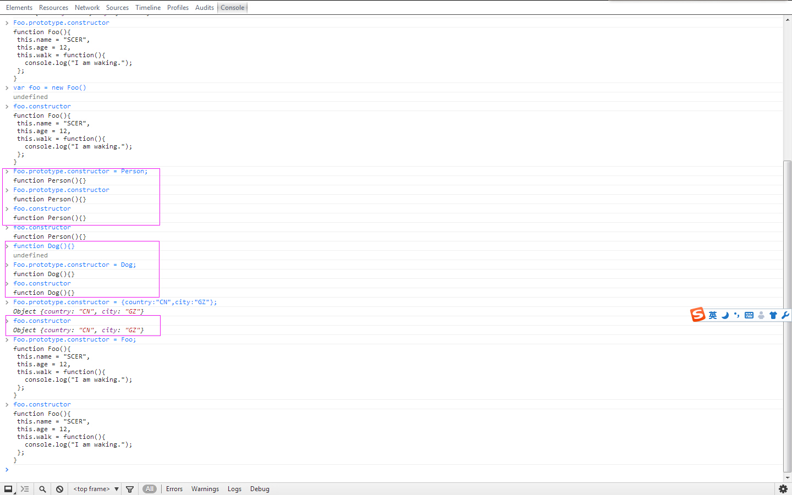

>`foo`的`constructor`属性是跟随着原型对象的`constructor`属性变化的。为了保证构造函数的对应一致性，在对原型对象重新赋值时，需要将该对象的`constructor`属性重新指向原构造函数。这也正是`prototype`继承中的一个缺陷，需要维护`constructor`的构造函数指向。

因为在重新创建一个对象时，默认应该指向`Foo`构造函数，但是却指向`Object`对象或`Foo.prototype.constructor`指定的其他函数。

```
> var foo1 = new Foo()
> undefined
> foo1.constructor
> Object {country: "CN", city: "GZ"}

```

<br>
#####**总结**

**那么，什么是原型，原型对象？**

原型`（prototype）`实际上就是一个`Javascript`对象。
原型对象是指属性和方法为实例对象所有共享的对象。当然，原型对象和实例对象基于同一个函数。

**什么是原型链？**

每个对象都有一个隐形的`__proto__`属性，这个属性指向原型对象并获取原型对象属性和方法的使用权。原型对象也是对象，也包含这个隐形属性并指向该对象的原型对象。如此层层相连，构成了原型链。
