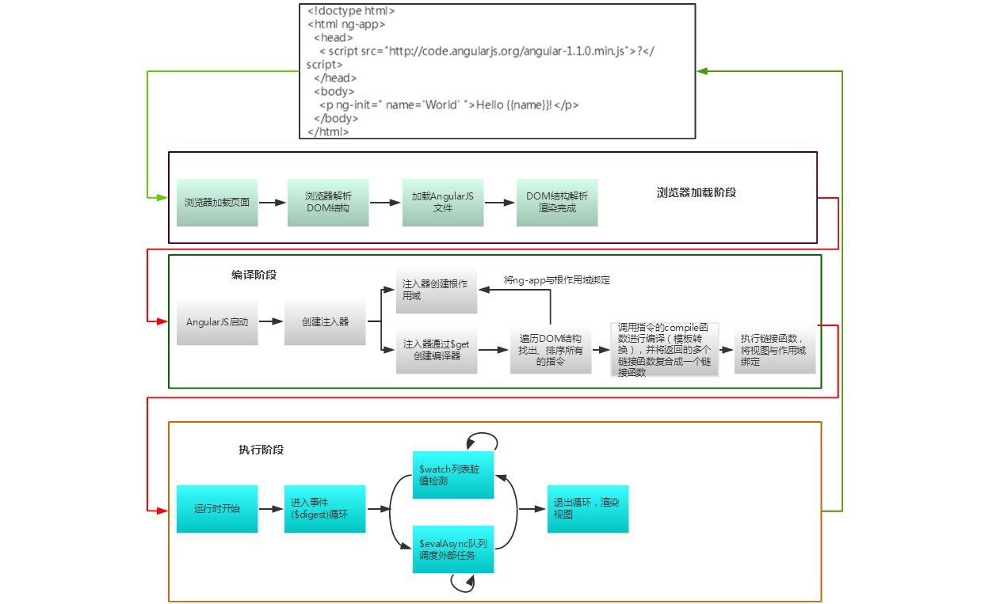

# AngularJS学习

`AngularJS`是一种动态的`web`开发框架。动态的`web`是指能与后台交互，获取数据以改变页面的静态状态。  
在使用`AngularJS`之前，我们是如何通过`jQuery`或其他`JavaScript`库构建动态的`web`应用的？在非框架的条件下，我们使用`ajax`与服务器通信获取动态数据及使用`jQuery`来动态的操作`DOM`结构等等。

那么，`AngularJS`是如何构建动态的`web`应用的？

<br>
**启动`AngularJS`框架**  
`AngularJS`框架的启动有两种方式，一种是自动引导启动，一种是手动引导启动。

######**自动引导启动**
```
<!doctype html>
<html ng-app>
  <head>
    <script src="http://code.angularjs.org/angular-1.1.0.min.js"></script>
  </head>
  <body>
    <p ng-init=" name='World' ">Hello {{name}}!</p>
  </body>
</html>
```

条件：
* 引入`AngularJS`文件
* 在`HTML`文档中设置`ng-app`指令。

<br>
######**手动引导启动**
`AngularJS`在`HTML`中只能包含一个`ng-app`，如果包含多个`ng-app`，将把第一个`ng-app`作为程序入口，并解析成根作用域。如果在同一个`HTML`想包含多个`AngularJS`应用，需要手动驱动。

```
angular.bootstrap(element, [modules], [config]);
```
<br>
>但通常情况下，我们使用自动引导启动`AngularJS`。

######**页面渲染流程**



<br>
#####**注入器**
`AngularJS`程序启动时，必然会先创建一个`$injector`容器。注入器是一个组件服务仓库，它管理着`AngularJS`应用的所有服务组件，这些组件称为`provider`供给者。这些组件之间不能直接相互调用，必须通过依赖注入的方式来实现通信。  
不管是控制器、服务、还是指令，过滤器等，它们在注入器里面都有一个相应的供给者/`provider`，这些供给者都提供一个`$get`方法，`$injector`注入器通过调用`$get`方法获取一个供给者的实例对象，以在`AngularJS`应用中服务。  
一般情况下，我们不需手动获取注入器实例，在自动引导启动时，会自动创建一个`$injector`容器。

<br>
#####**模块**
模块是应用程序的入口，也可以看做一块功能区，用来完成某些功能或组织某些相关功能代码。我们通过使用```angular.module("moduleName",[DI])```来定义一个模块。模块下的控制器、服务、过滤器或指令通常使用模块名作为命名空间（前缀）表示附属关系，使代码结构更加清晰可读。  
模块下的组件可以这样定义：
```JavaScript

  angular.module("app.service",...);
  angular.module("app.directive",...);
  angular.module("app.controller",...);
  angular.module("app.filter",...);
  
  angular.module("app",[app.service,app.directive,app.controller,app.filter])
  
```
`app`对于`HTML`文档中的`ng-app`的值，如果`HTML`中的`ng-app`没有值或值不是`app`，则会报错。

<br>
#####**控制器**
控制器是一个构造函数。在构建一个控制器的同时，会创建一个相对于`$rootScope`的子作用域。
控制器的主要作用就是创建、初始化作用域，并根据需求为作用域定义行为。从而起到了增强作用域的功能。  
作用域即为数据模型，我们通过为`scope`作用域设置属性或方法的方式来定义一个数据模型。

我们可以在模块下这样定义控制器：
```javascript
angular.module("app",[])
       .controller("appController",function($scope){
            ....
       })
```
该控制器仅在`app`模块起作用。一般不建议在全局作用域中定义控制器，会污染全局环境。

<br>
#####**指令**
指令是一种自定义的、具有某种行为能力的`HTML`元素、属性、类或注解。通过使用或定义指令，赋予`HTML`行为能力以完成特定的功能或进行数据的交互。通常情况下，通过定义指令来完成与`DOM`结构的各种交互或操作。  
我们通过`directory`来定义一个指令，来返回一个实例对象：
```javascript
angular.module("myDirecotry",function(){
    return {}
})
```


<br>
#####**服务**

一般情况下，服务用来保存持久性的数据。这些数据可以是通过`$http`从服务器中获取的数据，也可以是在全局环境下持久不变的数据。服务通过依赖注入的方式，与其它组件进行通信，它可以注入到控制器、指令或另一个服务中。

定义一个服务有5种方式：`factory`,`service`,`constant`,`value`,`provider`，使用方式、场景各有千秋，但都会返回一个实例对象。

<br>
#####**数据双向绑定**
`$apply`  `$watch`
