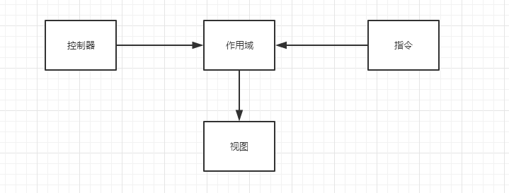

# 作用域

#####**作用域的定义**
- 作用域是数据模型对象（`Model`）
- 是表达式执行的上下文  
- ~~作用域的层级结构对应于`DOM`树结构(链式结构),可以嵌套、向上获取父级作用域的属性~~
- ~~作用域可以监听表达式（数据）的变化(双向数据绑定)并传播事件~~

<br>
#####**作用域的特性**
- 类似`DOM`树结构，基于原型链的工作机制
- 

<br>
#####**作用域的作用**
- 提供观察者以监视数据模型的变化（`$watch`）
  >双向数据绑定
- 可以将数据模型的变化通知给整个应用，甚至是系统外的组件  
  >提供(`$apply`)方法将不是由`Angular`触发的数据模型的改变引入`Angular`的控制范围内
- 可以进行嵌套，隔离业务功能和数据  
  >作用域基于原型链继承其父作用域属性的机制。
- 给表达式提供运算时所需的执行环境

<br>
####**`$rootScope`**
`$rootScope`是所有`$scope`对象的最上层，是`AngularJS`中最接近全局作用域的对象。一般在`$rootScope`上不会附加过多的业务逻辑，这与污染`JavaScript`的全局作用域是一个意思。


<br>
#####**作用域作为数据模型使用**
```
$scope.username = 'World';
```
`$scope`是一个`JavaScript`对象，它和它的属性或方法构成了数据模型。  
作用域是视图和控制器之间的粘合剂。它包含了渲染视图时所需的功能和数据，是所有视图的唯一源头。在创建控制器或指令时，会创建一个相应的作用域。

对于指令，在模板链接阶段时，指令会设置一个`$watch`函数监听作用域中的所有表达式（这个过程是隐式的）。这个`$watch`允许指令在作用域中的属性变化时收到通知，进而让指令能够根据这个改变来对`DOM`进行重新渲染，以便更新已改变的属性值。



<br>
#####**作用域分层结构**


<br>
#####**基于作用域的事件传播**

<br>
#####**作用域的生命周期**

######**作用域的执行上下文**


######**`scope`的生命周期**
$scope对象的生命周期处理有四个不同阶段。

1. **创建**  
>在创建控制器或指令时， `AngularJS`会用`$injector`创建一个新的作用域，并在这个新建的控
制器或指令运行时将作用域传递进去。
2. **链接**
>当`Angular`开始运行时，所有的$scope对象都会附加或者链接到视图中。所有创建`$scope`对
象的函数也会将自身附加到视图中。这些作用域将会注册当`Angular`应用上下文中发生变化时需
要运行的函数。  
这些函数被称为 `$watch`函数，` Angular`通过这些函数获知何时启动事件循环。

    `Note:`在链接过程中，指令会往作用域中注册一个或多个(`$watch`)监，听器，以检测数据模型的变化并对`DOM`进行更新操作。([执行期](/JavaScript模块/JavaScript框架/AngularJS学习/执行期.md))

3. **更新**
>当事件循环运行时，它通常执行在顶层`$scope`对象上（被称作`$rootScope`），每个子作用域
都执行自己的脏值检测。每个监控函数都会检查变化。如果检测到任意变化，` $scope`对象就会触
发指定的回调函数。
4. **销毁**
>当一个`$scope`在视图中不再需要时，这个作用域将会清理和销毁自己。  
`Angular`会自动清理作用域，而无需人为清除。但是也可以使用`$scope`上的`$destory()`方法来人为清除作用域。


