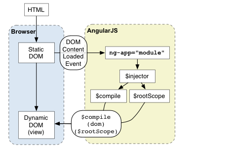
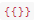

# 启动流程
```
<!doctype html>
<html ng-app>
  <head>
    <script src="http://code.angularjs.org/angular-1.1.0.min.js"></script>
  </head>
  <body>
    <p ng-init=" name='World' ">Hello {{name}}!</p>
  </body>
</html>
```


1. 浏览器载入`HTML`，然后把它解析成`DOM`
2. 浏览器载入`angular.js`脚本
3. `AngularJS`等到`DOMContentLoaded`事件触发
4. `AngularJS`寻找`ng-app`指令，这个指令指示了应用的边界
5. 创建应用所需的注入器（`injector`）
6. 以`ng-app`所在的节点为根节点，开始遍历并编译`DOM`树
7. 注入器创建"编译服务"（`$compile`）和"根作用域"(`$rootScope`)
8. 编译服务编译`DOM`并把它链接到根作用域
9. `ng-init`指令将`World`赋给作用域里的`name`变量
10. 通过表达式,显示`name`的值。
