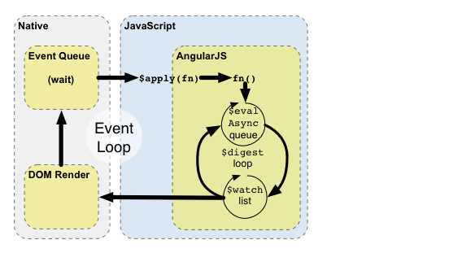

# 执行期

`AngularJS`与浏览器的事件回路交互


1. 浏览器的事件循环等待事件的触发。所谓事件包括用户的交互操作、定时事件、或者网络事件（服务器的响应）
2. 事件触发后，回调会被执行。此时会进入`JavaScript`上下文。通常回调可以用来修改`DOM`结构
3. 一旦回调执行完毕，浏览器就会离开`JavaScript`上下文，并且根据`DOM`的修改重新渲染视图。


`AngularJS`通过使用自己的事件处理循环，改变了传统的`Javascript`工作流。这使得`Javascript`的执行被分成原始部分和拥有`AngularJS`执行上下文的部分。  
只有在`AngularJS`执行上下文中运行的操作，才能享受到`AngularJS`提供的数据绑定，异常处理，资源管理等功能和服务。  
你可以使用 `$apply()`来从普通`Javascript`上下文进入`AngularJS`执行上下文。记住，大部分情况下（如在控制器，服务中），`$apply`都已经被用来处理当前事件的相应指令执行过了。只有当你使用自定义的事件回调或者是使用第三方类库的回调时，才需要自己执行`$apply`。

1. 通过调用 `scope.$apply(stimulusFn)`来进入`AngularJS`的执行上下文，这里的`stimulusFn`是你希望在`AngularJS`执行上下文中执行的函数。  
2. `AngularJS`会执行`stimulusFn()`，这个函数一般会改变应用的状态。  
3. ` AngularJS`进入`$digest`循环。这个循环是由两个小循环组成的，这两个小循环用来处理`$evalAsync`队列和`$watch`列表。这个`$digest`循环直到模型“稳定”前会一直迭代。这个稳定具体指的是`$evalAsync`对表为空，并且`$watch`列表中检测不到任何改变了。
4. 这个`$evalAsync`队列是用来管理那些“视图渲染前需要在当前栈框架外执行的操作的”。这通常使用 `setTimeout(0)`来完成的。用`setTimeout(0)`会有速度慢的问题。并且，因为浏览器是根据事件队列按顺序渲染视图的，还会造成视图的抖动。
5. `$watch`列表是一个表达式的集合，这些表达式可能是自上次迭代后发生了改变的。如果有检测到了有改变，那么`$watch`函数就会被调用，它通常会把新的值更新到`DOM`中。
6. 一旦`AngularJS`的`$digest`循环结束，整个执行就会离开`AngularJS`和`Javascript`的上下文。这些都是在浏览器为数据改变而进行重渲染之后进行的。


```
<!doctype html>
<html ng-app>
  <head>
    <script src="http://code.angularjs.org/angular-1.1.0.min.js"></script>
  </head>
  <body>
    <input ng-model="name">
    <p>Hello {{name}}!</p>
  </body>
</html>
```

1. 编译阶段
    *   `input`上的`ng-model`指令给`<input>`输入框绑定了`keydown`事件；
    *   `{{name}}`这个变量替换表达式建立了一个` $watch `来接受` name `变量改变的通知。
2. 执行器阶段
    * 按下任何一个键(以`X`键为例)，都会触发一个` input `输入框的`keydown`事件；
    * `input` 上的指令捕捉到 `input` 里值得改变，然后调用 `$apply(“name = ‘X’;”)`来更新处于`AngularJS`执行上下文中的模型；
    *  ` AngularJS`将` name='X'`应用到模型上；
    *  `$digest` 循环开始；
    *  `$watch `列表检测到`了name`值的变化，然后通知 `{{name}}`变量替换的表达式，这个表达式负责将`DOM`进行更新；
    * ` AngularJS`退出执行上下文，然后退出`Javascript`上下文中的`keydown`事件；
    * 浏览器以更新的文本重渲染视图。

#####**阅读**
- [AngularJS开发指南04：核心概览](https://gitcafe.com/Angularjs/Angularjs-Developer-Guide/blob/master/AngularJS%E5%BC%80%E5%8F%91%E6%8C%87%E5%8D%9704%EF%BC%9A%E6%A0%B8%E5%BF%83%E6%A6%82%E8%A7%88.md)