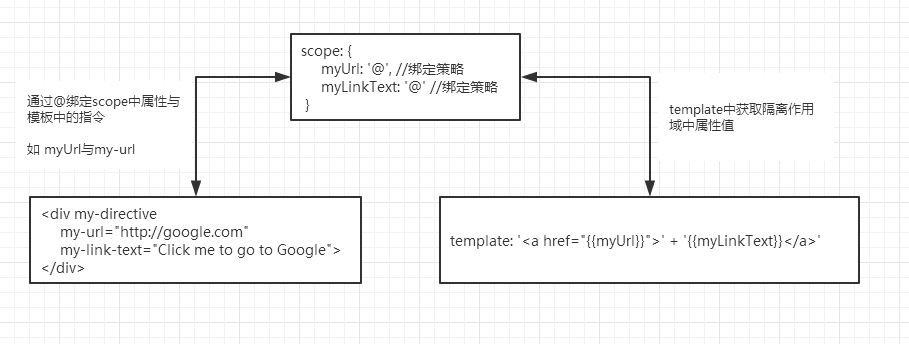

# 指令

- 指令本质上是`AngularJS`扩展具有自定义功能的`HTML`元素的途径。  
- 指令可以和其他指令或属性组合在一起使用，这种方式叫做组合。
- 指令在`AngularJS`编译`HTML`时就会被调用。

<br>
#####**第一个指令 **

```
<my-directive></my-directive>
```

######**定义`myDirective`指令**
```
angular.module('myApp',[])
.directive('myDirective', function() {
 return {
 restrict: 'E',
 template: '<a href="http://google.com">
 Click me to go to Google</a>'
 };
});
```

指令定义方式：

```
angular.module(模块名,模块依赖注入)
.directive(指令名称，函数);
```
**指令名称：**使用驼峰命名风格，如`HTML`中的`<my-directive>`在这里的命名为`myDirective`  
**函数：**函数用来注册一个新指令，应该返回一个对象。

<br>
######**指令渲染**
默认情况下，`AngularJS`将模板生成的`HTML`代码嵌套在自定义标签内部。
如`<my-directive></my-directive>`在浏览器中的渲染结果是这样的：

```html
<my-directive>
    <a href="http://google.com">
     Click me to go to Google
    </a>
</my-directive>
```

通过将`replace`设置为`true`可以实现将自定义标签从生成的`DOM`中完全移除掉。`replace`方法会用自定义元素(`Template`)取代指令声明，而不是嵌套在其内部.

```javascript
angular.module('myApp', [])
.directive('myDirective', function() {
 return {
 restrict: 'E',
 replace: true,
 template: '<a href="http://google.com">Click me to go to Google</a>'
 };
});
```
`<my-directive></my-directive>`在浏览器中的渲染结果如下：

```html
 <a href="http://google.com">
    Click me to go to Google
</a>
```

<br>
#####**声明指令 **
声明指令即是使用自定义元素。声明指令不需要创建一个新的自定义元素，它本质上是在`HTML`中通过元素、属性、类或注释来添加功能。

声明`<my-directive>`指令的合法格式：

```
    //作为元素
    <my-directive></my-directive>
    
    //作为属性
    <div my-directive></div>
    
    //作为类
    <div class="my-directive"></div>
    
    //作为注解
    <!--directive:my-directive-->
```
为了使`AngularJS`能够按照上面的声明方式调用指令，需要修改`<my-directive>`指令定义中的`restrict`设置。这个设置告诉`AngularJS`在编译`HTML`时用哪种声明格式来匹配指令定义。可以指定一个或多个格式。  
指令的格式主要有：元素`（E）`、属性`（A）`、类`（C）`或注释`（M）`

```
angular.module('myApp', [])
.directive('myDirective', function() {
 return {
 restrict: 'EAC',
 replace: true,
 template: '<a href="http://google.com">Click me to go to Google</a>'
 };
});
```
>为了更好的兼容浏览器，建议是用属性方式来定义指令。

<br>
#####**指令与表达式 **

######**用表达式声明指令 **
```javascript

<my-directive="someExpression"></my-directive>

<div my-directive="someExpression"></div>

<div class="my-directive:someExpression"></div>

<!-- directive: my-directive someExpression -->
```
######**当前作用域 **
在`DOM`中声明指令时如`ng-controller`会生成一个作用域，对于作用域下的表达式等而言，该作用域为当前作用域。

<br>
#####**向指令中传递数据 **
对`<my-directive>`指令进行修改，使其接收两个参数：

```javascript

angular.module('myApp', [])
.directive('myDirective', function() {
 return {
 restrict: 'A',
 replace: true,
 template: '<a href="{{ myUrl }}">{{ myLinkText }}</a>'
 }
});

```

上面的定义让指令接受两个参数：一个变量是`URL`，另一个是链接文本。
在`HTML`文档中，可以给指令添加`myUrl`和`myLinkText`属性，这两个参数会成为指令内部作用域的属性：

```javascript
<div my-directive
 my-url="http://google.com"
 my-link-text="Click me to go to Google">
</div>
```

在浏览器中的渲染结果：

```html
 <a href  my-directive
         my-url="http://google.com"
         my-link-text="Click me to go to Google"></a>
```

######**设置指令内部作用域中属性的值 **
设置指令内部作用域中属性的值主要有两种方式：
* 使用所属控制器提供的作用域
  >共享控制器的作用域存在这样的问题，如果控制器被移除或控制器的作用域存在相同命名的属性，这是我们需要重新修改指令代码。
*  创建新的子作用域或隔离作用域
  > 与子作用域不同（子作用域基于`DOM`），隔离作用域与当前`DOM`的作用域完全分隔开。与`javascript`中给方法传递参数一样，通过属性传递数据来给对象设置属性。
  

######**创建隔离作用域 **

修改指令，并定义隔离作用域：
```javascript
angular.module('myApp', [])
.directive('myDirective', function() {
 return {
 restrict: 'A',
 replace: true,
 scope: {
     myUrl: '@', //绑定策略
     myLinkText: '@' //绑定策略
 },
 template: '<a href="{{myUrl}}">' + '{{myLinkText}}</a>'
 };
});
```
调用：

```html
<div my-directive
     my-url="http://google.com"
     my-link-text="Click me to go to Google"></div>
```

**隔离作用域说明**

```javascript
scope: {
     myUrl: '@', //绑定策略
     myLinkText: '@' //绑定策略
 }
```
>这是一个隔离作用域，通过设置`scope`属性，指令拥有属于自己的`$scope`对象，这个对象只能在指令的方法或指令的模板字符串中使用。

工作机制


>通过`@`绑定策略，让`AngularJS`将`DOM`中的`my-url`属性的值复制到隔离作用域`scope`对象中的`myUrl`属性。  
默认情况下，`DOM`中的属性名与作用域`scope`中的属性名一致（除了拼写方式的不同）。可以通过如下方式显示指定绑定的属性名：
> ```javascript
scope: {
    myUrl: '@definitionUrl'
}
> ```
修改模板
> ```html
<div my-directive
 definition-url="url">
</div>
> ```

**隔离作用域的作用**  
>具有隔离作用域的指令最主要的使用场景是创建可复用的组件，组件可以在未知上下文中使
用，并且可以避免污染所处的外部作用域或不经意地污染内部作用域。

延伸  
* 可以在`DOM`对应的作用域上运算表达式，并将结果传递给指令，在指令内部
最终被绑定在属性上：
```html
<div my-directive
 definition-url="{{ 'http://' + 'google.com' }}">
</div>
```
* 双向数据绑定
