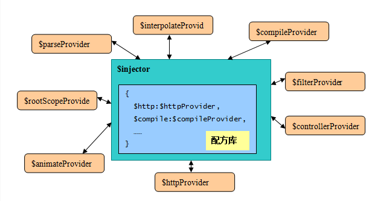
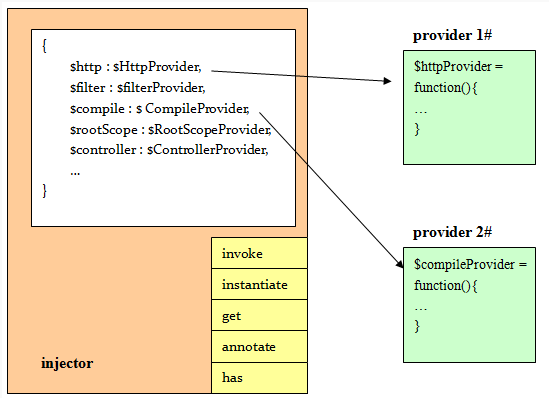

#`injector` 注入器

>注入器是`AngularJS`框架实现和应用开发的关键，这是一个`DI/IoC`容器的实现。

>`AngularJS`将功能分成了不同类型的组件分别实现，这些组件有一个统称 - 供给者/`provider`， 下图中列出了`AngularJS`几个常用的内置服务：



`AngularJS`的组件之间不可以互相直接调用，一个组件必须通过注入器才可以调用另一个组件。这样的好处是组件之间相互解耦，对象的整个生命周期的管理 甩给了注入器。

注入器实现了两个重要的功能：
* 集中存储所有`provider`的配方
> 配方其实就是：名称+类构造函数。`AngularJS`启动时，这些`provider`首先使用其配方在注入器 内注册。比如，`http`请求服务组件封装在`$httpProvider`类内，它通过`"$http"`这个名字在注入 器内注册。
* 按需提供功能组件的实例
> 其他组件，比如一个用户的控制器，如果需要使用`http`功能，使用`"$http"`这个名字 向注入器请求，就可以获得一个`http`服务实例了。


<br>
#####**注册服务组件**
从`injector`的角度看，组件就是一个功能提供者，因此被称为供给者/`Provider`。 在`AngularJS`中，`provider`以`JavaScript`类（构造函数）的形式封装。



服务名称通常使用一个字符串标识，比如`"$http"`代表`http`调用服务、`"$rootScope"`代表根 作用域对象`、"$compile"`代表编译服务...

`Provider`类要求提供一个`$get`函数（类工厂），`injector`通过调用该函数，就可以获得服务组件的实例。

名称和类函数的组合信息，被称为配方。`injector`中维护一个集中的配方库，用来按需创建不同的组件。这个配方库，其实就是一个`Hash`对象，`key`就是服务名称，`value` 就是类定义。


<br>
#####**调用服务组件**
######**获取注入器对象**
一般情况下，我们不需手动创建或获取注入器对象，应用在自动化启动会根据`ng-app`来自动创建一个注入器对象。但我们也可以通过手动来获取注入器对象。

######**创建新的注入器**
使用`angular.injector()`方法创建一个注入器
```javascript
angular.injector(modules, [strictDi]);
```
######**获取已创建的注入器**
```javascript
var element = angular.element(dom_element);
var injector = element.injector();
```

######**注入器调用API**
注入器有两个方法可供进行`API`调用：`invoke()`和`get()`。
* `invoke()`
使用注入器的`invoke()`方法，可以直接调用一个用户自定义的函数体，并通过函数参数 注入所依赖的服务对象，这是`AngularJS`推荐和惯例的用法：
```javascript
//ng模块是内置载入的，不需要显式指定
angular.injector(['ng'])
.invoke(function($http){
    //do sth. with $http
});
```
* `get()`
也可以使用注入器的`get()`方法，获得指定名称的服务实例：
```javascript
var my$http = angular.injector(['ng']).get('$http');
//do sth. with my$http
```