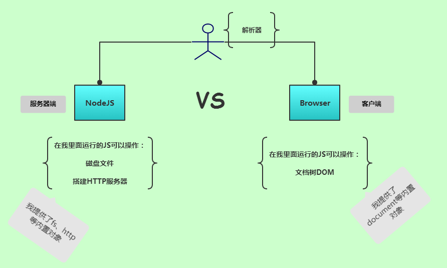
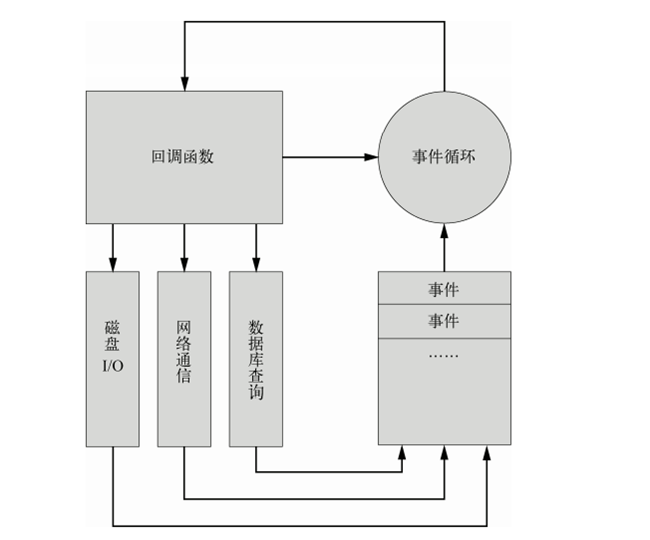
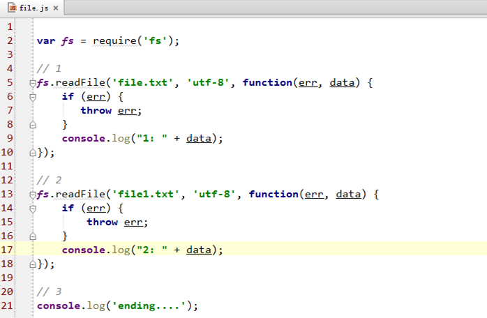
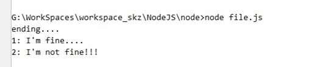
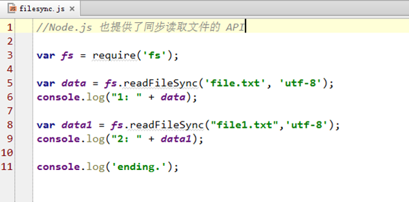
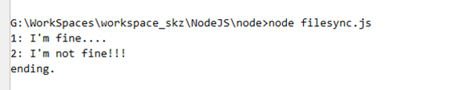

# NodeJS

#####**`NodeJS`与浏览器的简单比较**

###**`NodeJS`?**

####**`NodeJS`是什么？**

- `NodeJS`不是`JavaScript`框架，也不是`JavaScript`库。它是一个`JavaScript`解析器，让`JavaScript`脱离浏览器而能在服务器端运行。

- 使用了`V8`引擎 。`V8 JavaScript `引擎是 `Google` 用于其 `Chrome `浏览器的底层` JavaScript `引擎（用 `C++` 编写的超快解释器），`V8`引擎可嵌入任何应用程序中，让`JavaScript`在服务器端运行成为了可能。

####**如何工作 ？**

**`Node.js `采用单线程、异步式` I/O` 与事件式编程，而不是`I/O`同步的面向对象编程。**

 - 异步式 `I/O`针对所有 `I/O` 操作不采用阻塞的策略。当线程遇到` I/O` 操作时，不会以阻塞的方式等待 `I/O` 操作的完成或数据的返回，而只是将` I/O` 请求发送给操作系统，继续执行下一条语句。
当操作系统完成` I/O `操作时，以事件的形式通知执行` I/O` 操作的线程，线程会在特定时候处理这个事件。为了处理异步 `I/O`，线程必须有事件循环，不断地检查有没有未处理的事件，依次予以处理。

- 在非阻塞模式下，线程不会被 `I/O` 阻塞，一个线程永远在执行计算操作，永远在利用` CPU`。异步式 `I/O `减少了多线程的开销。

- `NodeJS`的这种工作机制形成了高并发的特性。

######**事件驱动**
`Node.js `的异步机制基于事件。`Node.js` 在执行的过程中会维护一个事件队 列，程序在执行时进入事件循环等待下一个事件到来，每个异步式` I/O `请求完成后会被推送 到事件队列，等待程序进程进行处理。所有的磁盘 `I/O`、网络通信、数据库查询都以非阻塞的方式请求，返回的结果由事件循环来处理。

事件循环的程序入口从第一个事件的回调函数开始。回调函数在处理过程中可能包含的`I/O`操作也将抛到事件队列中。回调函数执行完毕后再返回事件循环，事件循环会检查事件队列中有没有未处理的事件，直到程序结束。

######**异步操作**

######**异步操作结果**

1. 将读入文件的I/O交给OS，继续执行下一个语句
2. 执行console.log输出语句
3. 文件读入完成，事件响应，执行回调函数。  
.....

######**同步操作**

######**同步操作结果**

>按顺序执行输出。。。

####**特性？**
* `JavaScript`解析器
* 使用`V8`引擎
* 单线程、高并发
* 异步`I/O`，事件驱动

####**缺陷？**

* 只支持单核`CPU`，不能充分的利用多核CPU服务器
* 可靠性低，一旦代码某个环节崩溃，整个web服务都崩溃（原因：单进程，单线程）
* Debug不方便，错误没有`stack trace`
* 没有日志
* 独占端口
* 需要手动启动

######**独占端口：**
假如整个服务器只有一个网站，或者可以给每个网站分配一个独立的IP地址，不会有 端口冲突的问题。而很多时候为了充分利用服务器的资源，我们会在同一个服务器上 建立多个网站，而且这些网站可能有的是`PHP`，有的是Rails，有的是`Node.js`。不能每 个进程都独占80端口，所以我们有必要通过反向代理来实现基于域名的端口共享。

######**Web服务没有日志：**
Express框架中提供日志功能的解决方案。

######**调试不方便：**
可使用eclipse来调试NodeJS程序
或使用 node-inspector 调试 Node.js 

######**共享端口：**
从0.6 版本开始，Node.js 提供了一个核心模块：`cluster`。`cluster`的功能是生成与当 前进程相同的子进程，并且允许父进程和子进程之间共享端口。`Node.js `的另一个核心模块 `child_process` 也提供了相似的进程生成功能，但最大的区别在于`cluster` 允许跨进程端 口复用，给我们的网络服务器开发带来了很大的方便。

######**共享 80 端口：**
虚拟主机，就是让多个网站共享使用同一服务器同一IP地址，通过域名的不同来划分请 求。主流的HTTP服务器都提供了虚拟主机支持，如`Nginx、Apache、IIS`等。

####**使用场景？**
######**1) 适用场景**
* `JSON APIs`——构建一个`Rest/JSON API`服务`，Node.js`可以充分发挥其非阻塞IO模型以及`JavaScript`对`JSON`的功能支持
* 单页面、多Ajax请求应用——如Gmail，前端有大量的异步请求，需要服务后端有极高的响应速度
* 命令行工具（bower 、grunt等）
* 流式数据——实时文件上传系统
* 准实时应用系统——如聊天系统、微博系统

######**2) 不适用场景**
* CPU使用率较重、IO使用率较轻的应用——如视频编码、人工智能等，Node.js的优势无法发挥
* 简单Web应用——此类应用的特点是，流量低、物理架构简单
* 计算密集型的程序
* 逻辑十分复杂的事务（因为异步编程)）

####**NodeJS 核心模块**
######**文件操作**
>NodeJS提供了基本的文件操作API
同时提供部分同步和异步操作的API

* Buffer（提供对二进制数据的操作）
* Stream（数据流）
* File System（文件系统）
* Path（内置模块来简化路径相关操作）

######**网络操作**
* HTTP
* HTTPS
* URL
* Query String（URL参数字符串与参数对象的互相转换）
* Zlib
* Net（可用于创建Socket服务器或Socket客户端）

######**进程管理**
* Process（全局变量）
* Child Process（创建和控制子进程）
* Cluster（对Child Process模块的封装）

