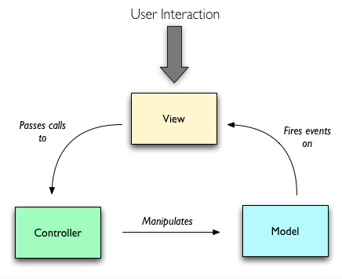
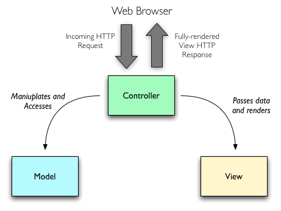

# MVC

>关于`MVC`的介绍和使用  

 - `M`：`Model` 模型
 - `V`：`View` 视图
 - `C`：`Controller` 控制器  
 
  

 
 
#####**传统`MVC`模式**
 - `View`接收用户的交互请求
 - `View`将请求转交给`Controller`
 - `Controller`完成业务逻辑后，对`Model`进行数据更新
 - `Model`将新的数据发送到`View`
 - `View`显示新的数据，用户得到反馈
 
  
 

#####**不完整的`MVC`模式**

 - 用户直接请求`Controller`
 - `Controller`操作访问`Model`，对`Model`进行更新
 - `Controller`将`Model`中更新的数据转送到`View`
 - `View`对数据进行渲染
 

#####**`MVC`的特点**
- `MVC`模式间的通信都是单向的。
- `View`和`Controller`使用`Strategy`（策略）模式实现，`View`使用`Composite`(组合)模式，`View`和`Model`使用`Observer`（观察者）模式。
- `Controller`对`View`的细节不可见，一个`Controller`可被多个`View`对用。
- `MVC`的一个缺点是难以对`Controller`进行单元测试

 
