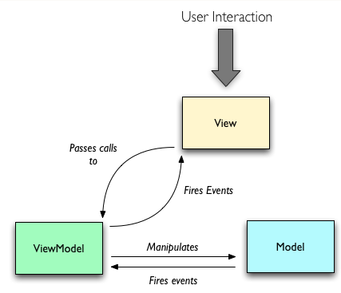

# MVVM

>关于`MVVM`的介绍和使用
>`MVVM`—`Model View ViewModel`

- `View`接受请求，并将请求移交给`ViewModel`
- `ViewModel`操作`Model`数据并更新
- `Model`通知`ViewModel`数据发生变化
- `ViewModel`更新`View`数据

 
#####**`MVVM`的特点**
- `MVVM`与`MVP`模式基本相同，唯一的区别是`MVVM`采用双向数据绑定，`ViewModel`发生改变，`View`随之发生变化，反之亦然
- 便于单元测试——~~`View`状态的定义包含在`ViewModel`的属性设置中~~
- `ViewModel`主要负责暴露方法，指令及其他属性以帮助维持视图状态，操作`Model`数据并作为结果返回给视图，同时触发`View`自身的事件