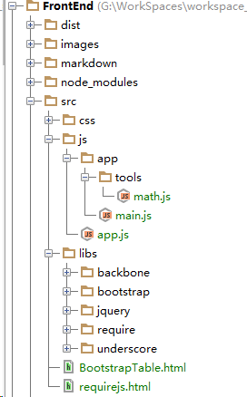

# RequireJS

>关于`require.js`介绍和使用  
>`require.js`遵循`AMD`规范


####`require`解决的问题：
- 实现js文件的异步加载，避免网页失去响应
- 管理模块间的依赖性，便于代码的编写和维护

<br>
####**模块定义**
>`define(['module',....],callback)`  
> 如果定义的模块不依赖其他模块，则直接定义`callback`函数。  
> `define(function(){.......})`  
> 否则指定依赖的模块，并在函数中指定该模块的访问替代参数，如下面的：  
> `underscore`通过`_`指代

```
define(["underscore"],function(_){

   var _add = function (x,y){

       return x + y;
   };

    return {
        add: _add
    }
});
```
<br>
####**模块调用**
> - 第一个参数为数组：指定了需要使用模块。
> - 第二参数是函数：函数的参数指代模块，并通过该指代参数在函数使用该模块

```
require(['moduleA', 'moduleB'], function (moduleA, moduleB){
　　　　// some code here
　});
　
```
<br>
####**模块加载**
>配置模块信息，如加载路径等  

```
require.config({
　　paths: {
　　　 "jquery": "jquery.min",
　　　 "underscore": "underscore.min",
　　　 "backbone": "backbone.min"
　　},
　　shim: {
        "underscore": {
            exports: "_"
        },
        "backbone": {
            deps: ["underscore", "jquery"],
            exports: "Backbone"
        }
    }
});
```

<br>
####**目录结构**



#####** HTML代码**

```
<!DOCTYPE html>
<html>
<head lang="en">
    <meta charset="UTF-8">
    <title>require js</title>
    <script data-main="js/app/main" src="libs/require/require.js" defer  async="true"></script>
</head>
<body>

</body>
</html>
```

> - `data-main`：指定网页程序的主模块（入口程序）。这个文件会第一个被`require.js`加载，`require.js`默认的文件后缀名是`js`，所以上面的`js/app/main.js`简写为`js/app/main`
> - 为了避免加载`require.js`时导致网页失去响应（上面写法，一般把`js`放在`</body>`后面），可以在`sript`中添加`defer`和`async`。
>  - `async`：表示这个文件需要异步加载。
>  - `defer`：IE不支持`async`，只支持`defer`属性

<br>
####**`main.js`文件**

```
/**
 * Created by eamiear on 2015/11/19.
 */

require.config({
    //基路经（依赖模块都在同一个基目录下）
    baseUrl: 'libs',
    //paths指定模块的加载路径
    paths: {
        "jquery": "jquery/dist/jquery",
        "underscore": "underscore/underscore-min",
        "backbone": "backbone/backbone",
        //如果定义的js不在指定的基路经下，则需要跳出该基路经
        "app": "../js/app",
        "math": "../js/app/tools/math"
    },

    // shim属性用来配置不兼容的模块（即不适遵循AMD规范的库）
    // exports: 输出的变量名，表示该模块外部调用时的名称
    // deps: 数组，表明该模块的依赖性
    shim: {
        "underscore": {
            exports: "_"
        },

        "backbone": {
            deps: ["underscore", "jquery"],
            exports: "Backbone"
        }
    }
});

//调用math模块
require(['math'],function(math){
   console.log("1 + 2 = " + math.add(1,2));
   console.log("1 / 2 = " + math.divide(1,2));
});

```
<br>
####**`math.js`文件**
```
/**
 * Created by eamiear on 2015/11/19.
 *
 * define module
 *
 * math.js
 */

define(["underscore"],function(_){

   var _add = function (x,y){

       return x + y;
   };

    var _minus = function (x, y){
        return x - y;
    };

    var _divide = function(x,y){
        y = (y === 0) ? _.random(1,10) : y;
        console.log(y);
        //return Math.floor(x/y);
        return x/y;
    };

    return {
        add: _add,
        minus: _minus,
        divide: _divide
    }
});

```

<br>
####**在浏览器中打开HTML文件**
```
1 + 2 = 3
1 / 2 = 0.5
```