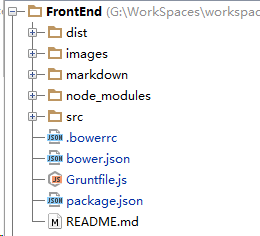

# Grunt

>`Grunt`的介绍和使用  


####** 下载安装 `nodejs` **####

>这里假设系统已经安装了NodeJs环境。

####** 安装 `grunt` `CLI` **####
```
    npm install -g grunt-cli
```
> - 这条命令将`grunt`命令设置到系统路径，以便在系统中任何目录，通过`grunt`运行项目。


####**创建 `grunt`项目 **#### 
`package.json`和`Gruntfile.js`是`Grunt`项目的必备文件。  

- `package.json`：配置项目元数据及`grunt`和`grunt`插件。
- `Gruntfile.js`：配置或定义任务和加载`Grunt`插件。
- `package.json`和`Gruntfile.js`需位于项目的同级目录中。  


####**运行 `grunt`项目 **#### 
- 打开命令行终端，进入项目路径并执行：`npm install`。  
 这条命令的作用是加载/下载`packag.json`中指定的插件或元数据。
- 在命令行终端执行 `grunt`命令，开始执行任务。
  
<br>

###** `package.json`和`Gruntfile.js`的配置**

**`package.json`**

```
{
  "name": "FrontEnd",
  "version": "1.0.0",
  "description": "FrontEnd",
  "main": "Gruntfile.js",
  "readme": "FrontEnd",
  "dependencies": {
    "grunt": "^0.4.5",
    "grunt-contrib-copy": "^0.8.0",
    "grunt-contrib-jshint": "^0.10.0",
    "grunt-contrib-sass": "*",
    "grunt-contrib-cssmin": "^0.12.2",
    "grunt-contrib-uglify": "^0.9.1",
    "grunt-contrib-watch": "*",
    "grunt-contrib-qunit": "*",
    "grunt-contrib-concat": "*",
    "grunt-autoprefixer": "~0.7.2",
    "grunt-contrib-compass": "latest"
  },
  "author": "FrontEnd",
  "license": "MIT",
  "devDependencies": {
    "autoprefixer": "^6.1.0",
    "grunt-contrib-compass": "^1.0.3",
    "grunt-postcss": "^0.7.1",
    "load-grunt-tasks": "^3.2.0"
  }
}

```
>这里配置了依赖的插件及相关元数据，如果需要手动下载相关依赖插件，可以在命令行中输入命令：  
`npm install grunt-contrib-jshint --save-dev`  
其中`grunt-contrib-jshint`是插件名。  

<br>
**`Gruntfile.js`**

```
module.exports = function(grunt) {

    // load all grunt tasks matching the ['grunt-*', '@*/grunt-*'] patterns
    //see node_modules-->load-grunt-tasks--->README.md
    //require('load-grunt-tasks')(grunt);

    // Project configuration.
    grunt.initConfig({
        pkg: grunt.file.readJSON('package.json'),

        //compressed JavaScript
        uglify: {
            options: {
                banner: '/*! <%= pkg.name %> <%= grunt.template.today("yyyy-mm-dd") %> */\n'
            },
            dist: {
                files: {
                    'dist/js/<%= pkg.name %>.min.js': ['<%= concat.dist.dest %>']
                }
            }
            /*build: {
             src: 'src/<%= pkg.name %>.js',
             dest: 'build/<%= pkg.name %>.min.js'
             }*/
        },

        jshint: {
            // define the files to lint
            files: ['Gruntfile.js', 'src/js/**/*.js', 'test/!**/!*.js'],
            // configure JSHint (documented at http://www.jshint.com/docs/)
            options: {
                // more options here if you want to override JSHint defaults
                globals: {
                    jQuery: true
                }
            }
        },

        concat: {
            options: {
                // define a string to put between each file in the concatenated output
                separator: ';'
            },
            dist: {
                // the files to concatenate
                src: ['src/js/**/*.js'],
                // the location of the resulting JS file
                dest: 'dist/js/<%= pkg.name %>.js'
            }
        },

        //compile sass and compass
        //https://www.npmjs.com/package/grunt-contrib-compass#cssdir
        compass: {
            dist: {
                options: {
                    config: 'src/css/config.rb',
                    //override the configuration in config.rb
                    sassDir: 'src/css/sass',
                    cssDir: 'src/css/styles',
                    imagesDir:'src/images',
                    javascriptsDir:'src/js',
                    fontsDir:'src/fonts'
                }
            }

        },
        //CSS3 autocomplete
        //see node_modules-->grunt-autoprefixer--->README.md
//        autoprefixer:{
//            options:{
//                browers:['last 2 version','ie 8','ie 9','ie 10']
//            },
//            multiple_files:{
//                expand: true,
//                flatten: true,
//                src:'src/css/styles/**/*.css',
//                dest:'dist/css/'
//            }
//        },

        //autoprefixer for user agents
        postcss: {
            options: {
                map: false,
                processors: [
                    require('autoprefixer')({browsers: [
                        'ie >= 8',
                        'ie_mob >= 10',
                        'ff >= 30',
                        'chrome >= 34',
                        'safari >= 7',
                        'opera >= 23',
                        'ios >= 7',
                        'android >= 2.3',
                        'bb >= 10'
                    ]})
                ]
            },
            dist: {
                src: 'src/css/styles/**/*.css'
            }
        },

        //see node_modules-->grunt-contrib-watch--->README.md
        watch: {
            options: {
                livereload: true
            },
            css: {
                files: 'src/css/**/*.scss',
                tasks: ['compass']
            },
            styles:{
                files:'src/css/**/*.css',
                tasks:['postcss']
            }
        }
    });

    grunt.loadNpmTasks('grunt-contrib-uglify');
    grunt.loadNpmTasks('grunt-contrib-jshint');
    grunt.loadNpmTasks('grunt-contrib-watch');
    grunt.loadNpmTasks('grunt-contrib-concat');
    grunt.loadNpmTasks('grunt-contrib-compass');
    //grunt.loadNpmTasks('grunt-autoprefixer');
    grunt.loadNpmTasks('grunt-postcss');

    // this would be run by typing "grunt test" on the command line
    grunt.registerTask('test', ['jshint']);

    // the default task can be run just by typing "grunt" on the command line
    grunt.registerTask('default', ['jshint', 'concat', 'uglify','watch']);

};


```

###**项目结构**###

