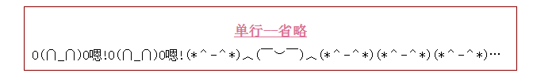
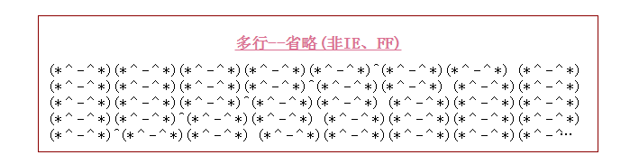
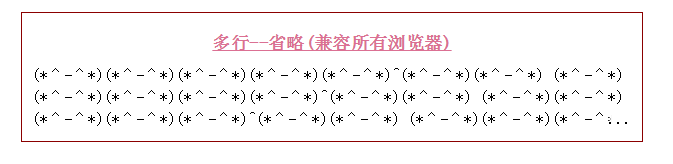

# 单行、多行省略

#####**单行省略**

`html`
```
<div class="pack">
        <h2>单行--省略</h2>
        <div class="single-row">
            O(∩_∩)O嗯!O(∩_∩)O嗯!(*＾-＾*)︿(￣︶￣)︿(*＾-＾*)(*＾-＾*)(*＾-＾*)^
            O(∩_∩)O嗯!O(∩_∩)O嗯!(*＾-＾*)︿(￣︶￣)︿(*＾-＾*)(*＾-＾*)(*＾-＾*)^
            O(∩_∩)O嗯!O(∩_∩)O嗯!(*＾-＾*)︿(￣︶￣)︿(*＾-＾*)(*＾-＾*)(*＾-＾*)^
            O(∩_∩)O嗯!O(∩_∩)O嗯!(*＾-＾*)︿(￣︶￣)︿(*＾-＾*)(*＾-＾*)(*＾-＾*)^
        </div>
    </div>
```
`css`
```
.pack {
  width: 600px;
  margin: 30px auto;
  padding: 10px;
  border: 1px solid darkred;

}
.pack h1, .pack h2, .pack h3, .pack h4, .pack h5, .pack h6 {
  width: 50%;
  margin: 0 auto;
  padding: 10px;
  color: palevioletred;
  font-size: 18px;
  text-align: center;
  text-decoration: underline;
}
.pack .single-row {
  overflow: hidden;
  white-space: nowrap;
  text-overflow: ellipsis;
}
```
######效果图



<br>
#####**多行省略**

- ###### **only for Chrome and Safari for PC**
  

`html`
```
<div class="pack">
        <h2>多行--省略(非IE、FF)</h2>
        <div class="multi-row">
           (*＾-＾*)(*＾-＾*)(*＾-＾*)(*＾-＾*)(*＾-＾*)^(*＾-＾*)(*＾-＾*)
           (*＾-＾*)(*＾-＾*)(*＾-＾*)(*＾-＾*)(*＾-＾*)^(*＾-＾*)(*＾-＾*)
           (*＾-＾*)(*＾-＾*)(*＾-＾*)(*＾-＾*)(*＾-＾*)^(*＾-＾*)(*＾-＾*)
           (*＾-＾*)(*＾-＾*)(*＾-＾*)(*＾-＾*)(*＾-＾*)^(*＾-＾*)(*＾-＾*)
           (*＾-＾*)(*＾-＾*)(*＾-＾*)(*＾-＾*)(*＾-＾*)^(*＾-＾*)(*＾-＾*)
           (*＾-＾*)(*＾-＾*)(*＾-＾*)(*＾-＾*)(*＾-＾*)^(*＾-＾*)(*＾-＾*)
           (*＾-＾*)(*＾-＾*)(*＾-＾*)(*＾-＾*)(*＾-＾*)^(*＾-＾*)(*＾-＾*)
        </div>
    </div>
```
`css`
```
.pack {
  width: 600px;
  margin: 30px auto;
  padding: 10px;
  border: 1px solid darkred;
}
.pack h1, .pack h2, .pack h3, .pack h4, .pack h5, .pack h6 {
  width: 50%;
  margin: 0 auto;
  padding: 10px;
  color: palevioletred;
  font-size: 18px;
  text-align: center;
  text-decoration: underline;
}

.pack .multi-row {
  overflow: hidden;
  text-overflow: ellipsis;
  display: -webkit-box;
  -webkit-line-clamp: 5;
  line-clamp: 5;
  -webkit-box-orient: vertical;
  box-orient: vertical;
}
```
######效果图



- ###### **Multi-lines ellipsis for all browsers**

`html`
```
<div class="pack">
        <h2>多行--省略(兼容所有浏览器)</h2>
        <div class="multi-compatible-row">
            (*＾-＾*)(*＾-＾*)(*＾-＾*)(*＾-＾*)(*＾-＾*)^(*＾-＾*)(*＾-＾*)
            (*＾-＾*)(*＾-＾*)(*＾-＾*)(*＾-＾*)(*＾-＾*)^(*＾-＾*)(*＾-＾*)
            (*＾-＾*)(*＾-＾*)(*＾-＾*)(*＾-＾*)(*＾-＾*)^(*＾-＾*)(*＾-＾*)
            (*＾-＾*)(*＾-＾*)(*＾-＾*)(*＾-＾*)(*＾-＾*)^(*＾-＾*)(*＾-＾*)
            (*＾-＾*)(*＾-＾*)(*＾-＾*)(*＾-＾*)(*＾-＾*)^(*＾-＾*)(*＾-＾*)
            (*＾-＾*)(*＾-＾*)(*＾-＾*)(*＾-＾*)(*＾-＾*)^(*＾-＾*)(*＾-＾*)
            (*＾-＾*)(*＾-＾*)(*＾-＾*)(*＾-＾*)(*＾-＾*)^(*＾-＾*)(*＾-＾*)
            <span class="ie-ellipsis">...</span>
        </div>
    </div>
```
`css`

```
.pack {
  width: 600px;
  margin: 30px auto;
  padding: 10px;
  border: 1px solid darkred;
}
.pack h1, .pack h2, .pack h3, .pack h4, .pack h5, .pack h6 {
  width: 50%;
  margin: 0 auto;
  padding: 10px;
  color: palevioletred;
  font-size: 18px;
  text-align: center;
  text-decoration: underline;
}

/*-------------- key code -----------------*/

.multi-compatible-row {
  position: relative;
  line-height: 1.4em;
  
  /*  3 times line-height for height to show 3 lines. (can be any other num)*/
  
  height: 4.2em;
  overflow: hidden;
}

.multi-compatible-row, .multi-compatible-row:after {
  /* the background-color should be the same */
  background-color: #fff;
}

.multi-compatible-row:after {
  position: absolute;
  bottom: 0;
  right: 0;
  display: block;
  content: "...";
  
  /* take one row -- same as the line-height*/
  height: 1.4em;
  padding: 0 0 2px 0;
  
  /*background: url(ellipsis_bg.png) repeat-y;*/
  
  background: -webkit-gradient(linear, left top, right top, from(rgba(255, 255, 255, 0)), color-stop(15%, white), color-stop(15%, white));
  background: -webkit-linear-gradient(left, rgba(255, 255, 255, 0), white 15%, white);
  background: linear-gradient(to right, rgba(255, 255, 255, 0), white 15%, white);
}


/* compatible for IE6~7 , IE6~7 not support "content" */
.multi-compatible-row .ie-ellipsis {

  display: none;    /* hide for others*/
  *display: block;  /* show for IE7*/
  _display: block;  /* show for IE6*/
  
  position: absolute;
  right: 0;
  bottom: 0;
  
  line-height: 1.4em;
  font-weight: 600;
  background: #fff;
  padding: 0,5px,2px,5px;
  
}
```
######效果图



 
#####**`SASS` 文件**
```
.pack{
  width: 600px;
  margin: 30px auto;
  padding: 10px;
  border: 1px solid darkred;

  h1,h2,h3,h4,h5,h6{
    width: 50%;
    margin: 0 auto;
    padding: 10px;

    color: palevioletred;
    font-size: 18px;
    text-align: center;
    text-decoration: underline;
  }

  /*single-line ellipsis,All browsers compatible*/
  .single-row{
    overflow: hidden;
    white-space: nowrap;
    text-overflow: ellipsis;
  }

  /*only for Chrome and Safari for PC*/
  .multi-row{
    overflow: hidden;
    text-overflow: ellipsis;

    display: -webkit-box;
    -webkit-line-clamp: 5;
    line-clamp: 5;
    -webkit-box-orient: vertical;
    box-orient: vertical;
  }

  /*Multi-lines ellipsis for all browsers*/
  .multi-compatible-row{

  }

}

.multi-compatible-row{
  position:relative;
  line-height:1.4em;

  /*  3 times line-height for height to show 3 lines. (can be any other num)*/
  height:4.2em;
  overflow:hidden;

  &,&:after{
    /* the background-color should be the same */
    background-color: #fff;
  }

  &:after{
    position: absolute;
    bottom: 0;
    right: 0;

    display: block;
    content: "...";
    /* take one row -- same as the line-height*/
    height: 1.4em;

    padding: 0 0 2px 0;
    /*background: url(ellipsis_bg.png) repeat-y;*/
    background: linear-gradient(to right, rgba(255, 255, 255, 0), white 15%, white);
  }

  /* compatible for IE6~7 , IE6~7 not support "content" */
  .ie-ellipsis{
    display: none;
    *display: block;
    _display: block;

    position: absolute;
    right: 0;
    bottom: 0;

    line-height: 1.4em;

    font-weight: 600;
    background: #fff;
    padding: 0,5px,2px,5px;
  }

}
```

#####**生成兼容所有浏览器的 `SASS` `mixin` 文件**

`mixin.scss`
```
/*
 * $lineHeight--line-height
 * $lineCounts--line-count
 */
@mixin multi-rows($lineHeight,$lineCounts){
  position:relative;
  line-height:$lineHeight;

  /*  3 times line-height for height to show 3 lines. (can be any other num)*/
  height:$lineCounts * $lineHeight;
  overflow:hidden;

  &,&:after{
    /* the background-color should be the same */
    background-color: #fff;
  }

  &:after{
    position: absolute;
    bottom: 0;
    right: 0;

    display: block;
    content: "...";
    /* take one row -- same as the line-height*/
    height: $lineHeight;

    padding: 0 0 2px 0;
    /*background: url(ellipsis_bg.png) repeat-y;*/
    background: linear-gradient(to right, rgba(255, 255, 255, 0), white 15%, white);
  }

  /* compatible for IE6~7 , IE6~7 not support "content" */
  .ie-ellipsis{
    display: none;
    *display: block;
    _display: block;

    position: absolute;
    right: 0;
    bottom: 0;

    line-height: $lineHeight;

    font-weight: 600;
    background: #fff;
    padding: 0,5px,2px,5px;
  }
}
```
######**调用**

```
@import "mixin";

.mu {
  @include multi-rows(1.4em,3)
 }
```

<br>
#####**使用 `JS`实现多行省略 **
```
<script>
    //get the total character length.

    //(width / yourFontSize) == 一行子母个数
   // var totalLength = (width / yourFontSize) * yourNumberOfLines

    function shorten(text,totalLength){
        var ret = text;
        if (ret.length > totalLength) {
            ret = ret.substr(0, totalLength-3) + "...";
        }
        return ret;
    }
</script>
```