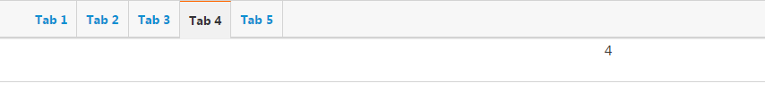

# 本地存储

###**`localStorage`**

>`localStorage` 允许你操作本地存储对象。`localStorage`与`sessionStorage`相似。唯一不同的是，`localStorage`中的数据没有时间限制，而对于`sessionStorage`，当浏览器会话结束(即浏览器关闭)时，`sessionStorage`中数据将被清除。

<br>
#####**语法**

```
myStorage = localStorage;

// 或 

myStorage = window.localStorage;

//localStorage是window的属性

```

#####**值**

一个`Storage`对象。

即 `window.localStorage`指向（是）一个 `Storage`对象，可以调用`Storage`的`API`接口方法进行数据操作。

#####**示例**

```
localStorage.setItem('myCat', 'Tom');
```
该脚本操作当前域的本地`Storage`对象，并通过`Storage`的`setItem()`方法添加了一个数据项。

<br>
###**`sessionStorage`**
>`sessionStorage`与`localStorage`基本相同，不同之处在于`localStorage`的数据不会过期，而`sessionStorage`中的数据在会话结束后被清除。页面会话在浏览器打开期间一直保持，并且重新加载或恢复页面仍会保持原来的页面会话。在新标签或窗口打开一个页面会初始化一个新的会话。


<br>
###**`Storage`**

- `Storage`接口提供了对会话存储(`session storage`)和本地存储(`local storage`)的操作，可以对存储数据项进行增、删、改操作。
- `Storage`与对象一样，以键值对保存数据。`key`可以试字符串或整数，但`value`总是字符串。`Storage`可以像对象一样操作数据或者使用自身的接口方法。

<br>
#####**`Storage`提供的属性和方法**

######**属性**

- `Storage.length` (只读) 返回数据项的个数。

######**方法**

- `storage.key(key)`  
返回指定下标的`key`键值，参数`key`表示数据项在`Storage`中存储位置，整数(`0,1,2...`).

- `storage.getItem(keyName)`  
获取指定键值名称`keyName`的`value`值。

- `storage.setItem(keyName, keyValue)` 
新增属性或更新已存在的属性。

- `storage.removeItem(keyName)` 
删除指定的属性。
- `Storage.clear()` 
清空`storage`


<br>
#####**检测浏览器是否支持`Storage`**

```
function storageAvailable(type) {
	try {
		var storage = window[type],
			x = '__storage_test__';
		storage.setItem(x, x);
		storage.removeItem(x);
		return true;
	}
	catch(e) {
		return false;
	}
}
```
这个方法检测浏览器是否支持`localStorage`特性且是否可用。某些浏览器支持`localStorage`特性，但提供了不启用`localStorage`的设置。所以存在浏览器支持`localStorage`但不能在脚本中使用的情况。


使用：
```
if (storageAvailable('localStorage')) {
	// Yippee! We can use localStorage awesomeness
}
else {
	// Too bad, no localStorage for us
}
```


<br>
#####**向`storage`设置值**
```
function populateStorage() {
  localStorage.setItem('bgcolor', document.getElementById('bgcolor').value);
  localStorage.setItem('font', document.getElementById('font').value);
  localStorage.setItem('image', document.getElementById('image').value);

  setStyles();
}
```

<br>
#####**从`storage`获取值**

```
var htmlElem = document.querySelector('html');
var pElem = document.querySelector('p');
var imgElem = document.querySelector('img');

var bgcolorForm = document.getElementById('bgcolor');
var fontForm = document.getElementById('font');
var imageForm = document.getElementById('image');

function setStyles() {
  
  //从storage中获取值
  var currentColor = localStorage.getItem('bgcolor');
  var currentFont = localStorage.getItem('font');
  var currentImage = localStorage.getItem('image');

  //在页面中使用
  
  document.getElementById('bgcolor').value = currentColor;
  document.getElementById('font').value = currentFont;
  document.getElementById('image').value = currentImage;

  htmlElem.style.backgroundColor = '#' + currentColor;
  pElem.style.fontFamily = currentFont;
  imgElem.setAttribute('src', currentImage);
}
```

<br>
#####**通过对象方式操作`storage`值**

```
localStorage.setItem('colorSetting', '#a4509b');

//对象方式
localStorage.colorSetting = '#a4509b';
localStorage['colorSetting'] = '#a4509b';

```

<br>
#####**删除对象记录**

```
localStorage.removeItem('bgcolor');

// or
localStorage.clear();
```


<br>
#####**`storage`事件**

`StorageEvent`事件：一旦`Storage`对象发生变化时，就会触发`StorageEvent`事件。但这个事件不会在当前发生变化的页面起作用，只作用于同域下的其他页面，并同步发生变化的`Storage`对象。不同域操作不同的`Storage`(`Storage`不能跨域共享).

######**存储事件的属性和方法**
######属性

| 属性 | 类型 | 描述(只读) |
| -- | -- | -- |
| key | DOMString | 发生变化的key |
| newValue | DOMString | 变化后的新值 |
| oldValue| DOMString | 变化前的值 |
| storageArea | nsIDOMStorage | 被影响的`Storage`对象 |
| url| DOMString | key发生变化的文档的URL |

######方法
`initStorageEvent()`

#####**示例**
>打开页面显示上次的tab状态

```
<!DOCTYPE html>
<html>
<head lang="en">
    <meta charset="UTF-8">
    <title></title>
    <link rel="stylesheet" href="css/styles/base.css"/>
    <style>

        #nav {
            height: 42px;
            border: 1px solid #d3d3d3;
            background: #f7f7f7;
            -moz-border-radius: 2px;
            -webkit-border-radius: 2px;
            border-radius: 2px;
            -moz-box-shadow: 1px 1px 2px rgba(0, 0, 0, .2);
            -webkit-box-shadow: 1px 1px 2px rgba(0, 0, 0, .2);
            box-shadow: 1px 1px 2px rgba(0, 0, 0, .2);
        }

        #nav ul{
            list-style: none;
        }

        #nav li {
            float: left;
            height: 42px;
            line-height: 42px;
            border-right: 1px solid #d3d3d3;
            font-size: 14px;
            font-weight: bold;
            padding: 0 10px;
        }

        #nav li.cur {
            background: #f1f1f1;
            border-top: 1px solid #f60;
            box-shadow: none;
        }

        #nav li a {
            text-decoration: none;
            display: block;
        }

        #nav li.cur a {
            color: #333;
        }

        #nav li a:hover {
            color: #f30;
        }

        #page {
            border: 1px solid #d3d3d3;
            height: 50px;
            text-align: center;
        }

        .list {
            display: none;
        }
    </style>
</head>
<body>
<div id="nav">
    <ul>
        <li><a href="#">Tab 1</a></li>
        <li><a href="#">Tab 2</a></li>
        <li><a href="#">Tab 3</a></li>
        <li><a href="#">Tab 4</a></li>
        <li><a href="#">Tab 5</a></li>
    </ul>
</div>
<div id="page">
    <div class="list">1</div>
    <div class="list">2</div>
    <div class="list">3</div>
    <div class="list">4</div>
    <div class="list">5</div>
</div>
</body>

<script src="libs/jquery/dist/jquery.min.js"></script>
<script>

    $(function(){
        init();
    });

    /**
     * 是否支持Storage
     *
     */
    function storageAvailable(type) {
        try {
            var storage = window[type],
                x = '__storage_test__';
            storage.setItem(x, x);
            storage.removeItem(x);
            return true;
        }
        catch(e) {
            return false;
        }
    }

    /**
     * 显示tab和list
     * @param obj
     * @param index
     */
    function showTabList(obj,index){
        index = index? index : 0;

        //tab高亮
        if(obj){
           $(obj).addClass("cur").siblings("li").removeClass("cur");
        }else{
           $("#nav").find("li").eq(index).addClass("cur").siblings("li").removeClass("cur");
        }


        //显示对应的list
        $(".list").eq(index).show().siblings().hide();
    }

    /**
     * 初始化
     */
    function init (){

        if (storageAvailable('localStorage')) {

            //上次点击的tab下标
            var preTab = localStorage.getItem("tabbed");

            //第一次打开，初始化第一个tab，index为0
            if(!preTab){
                showTabList();
            }


            //遍历所有tab
            $("#nav").find("li").each(function(index){
                var $li = $(this);


                //非第一次，则初始化显示上次点击的tab
                if(index == preTab){
                    showTabList(null,index);
                }

                //li绑定click事件
                $li.click(function(){
                    showTabList(this,index);

                    //设置tabbed值
                    localStorage.setItem("tabbed",index);
                });
            })

        }
        else {
            // Too bad, no localStorage for us
        }
    }
</script>
</html>

```

#####**效果**



<br><br>
#####**阅读**
- [localStorage](https://developer.mozilla.org/en-US/docs/Web/API/Window/localStorage)
- [sessionStorage](https://developer.mozilla.org/zh-CN/docs/Web/API/Window/sessionStorage)
- [Storage](https://developer.mozilla.org/en-US/docs/Web/API/Storage)
- [Using the Web Storage API](https://developer.mozilla.org/en-US/docs/Web/API/Web_Storage_API/Using_the_Web_Storage_API#Basic_concepts)
- [StorageEvent](https://developer.mozilla.org/en-US/docs/Web/API/StorageEvent)
- [web-storage-demo](https://github.com/mdn/web-storage-demo)
- [11 Web storage](https://html.spec.whatwg.org/multipage/webstorage.html#webstorage)
- [HTML5本地存储-helloweba.com](http://www.helloweba.com/view-blog-201.html)