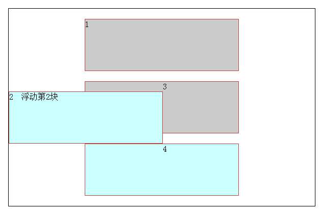

# 浮动

>CSS中的`float`属性，默认为`none`，也就是标准流通常的情况。如果将`float`属性的值设置为`left`或`right`，元素就会向其父元素的左侧或右侧靠紧，同时默认情况下，盒子的宽度不在伸展，而是根据盒子里面的内容的宽度来确定。

* 浮动的元素不再具有`clear`清除浮动功能，新增一个标签来辅助实现清除功能。
* 浮动的元素脱离文档流，是指元素不再占据当前的位置，后面的元素会向上移动。
* 浮动元素脱离了文档流，但它的位置仍然相对于前面的元素（如果有其他元素的话）。
